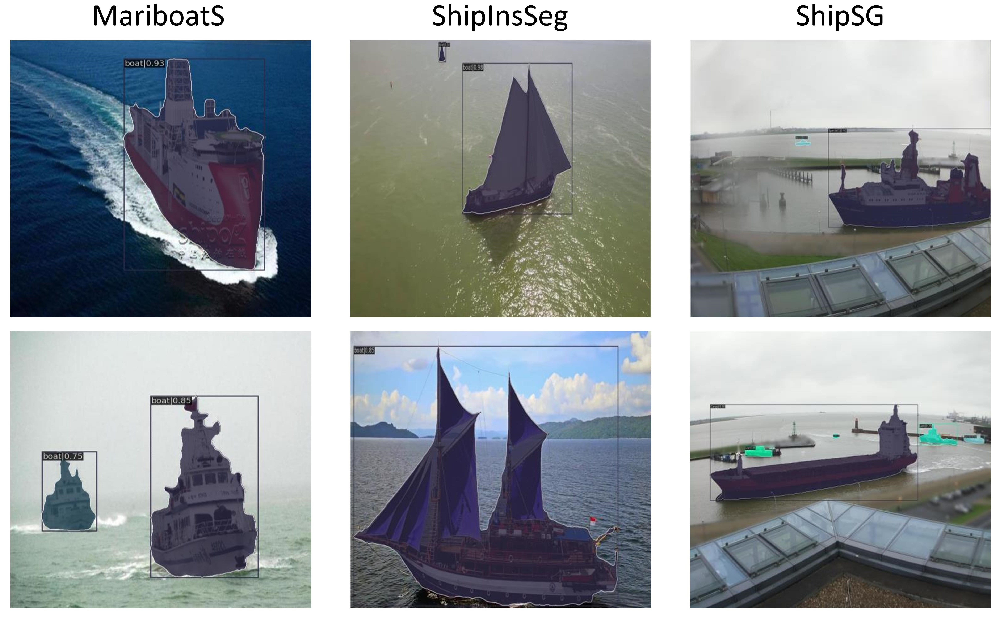
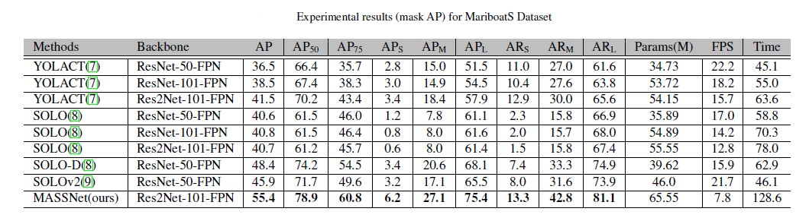
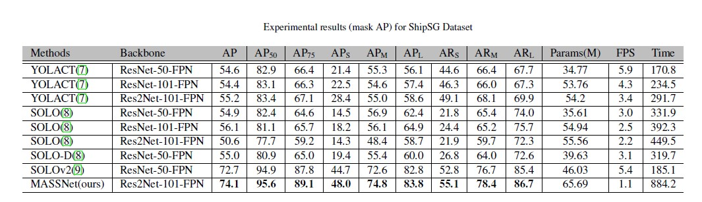

# MASSNet:Multiscale Attention for Single-Stage Ship Instance Segmentation

## Performances

 

 

 

## Installation
Our MASSNet is based on [mmdetection](https://github.com/open-mmlab/mmdetection). Please check [INSTALL.md](https://github.com/shrmarabi/MASSNet/blob/main/install.md) for installation instructions.

## A quick Demo
a. Download the train weights from google drive (link attached) for the three marine datasets below:
+ [Train weights for MariboatS](https://drive.google.com/file/d/1lVF7bsQ59HG0xZXCC3ts-1AvPcnnd4GA/view?usp=drive_link)
+ [Train weights for ShipInsSeg](https://drive.google.com/file/d/15gMv_ypnKMAj_RLVl-ZphqRq0F7fL4r-/view?usp=drive_link)
+ [Train weights for ShipSG](https://drive.google.com/file/d/1jH-4xFv_EWPocAbi_4ZtFpNTmDwrIZ2L/view?usp=sharing)
  
