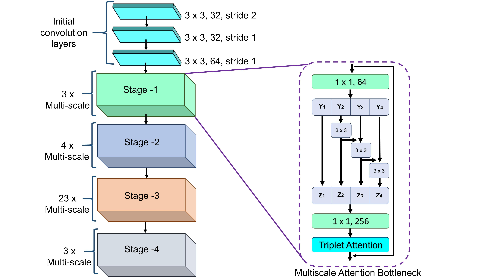
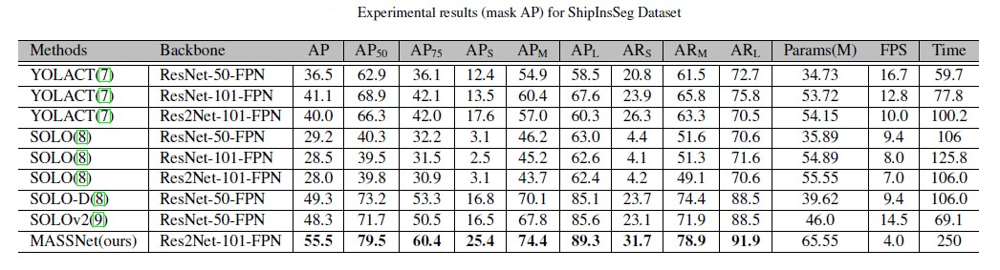

# MASSNet:Multiscale Attention for Single-Stage Ship Instance Segmentation

## Performances

 

 

 

## Installation
Our MASSNet is based on [mmdetection](https://github.com/open-mmlab/mmdetection). Please check [INSTALL.md]([INSTALL.md](https://github.com/shrmarabi/MASSNet/blob/main/install.md)https://github.com/shrmarabi/MASSNet/blob/main/install.md) for installation instructions.
